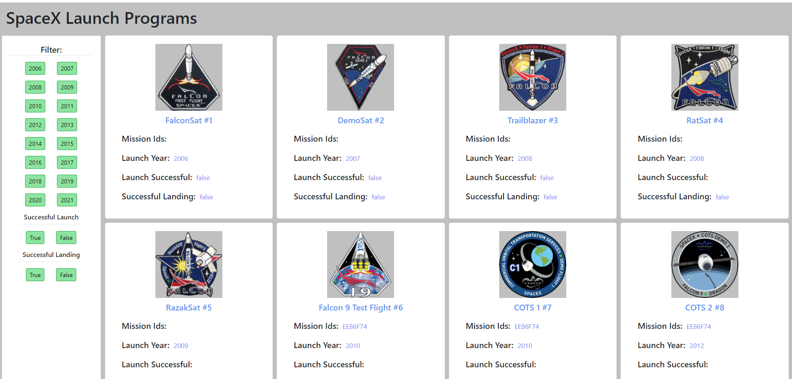

# SpaceX Launch Programs  🚀

[Click to see Website](https://spacex-program-list.herokuapp.com/)

### Built With

* React.js
* CSS for Responsiveness as mentioned
*  Used Bootsrap for some portions

## Getting Started

Setup Guide of REACTJS is given inside Readme file of client folder.

### Prerequisites

*
   ```JS
   const API_KEY = 'https://api.spaceXdata.com/v3/launches?limit=100';
   ```

## Project Structure
All files are added in client folder.
Client folder hierarchy :
    
    ├── public                 
    ├── src                 
    ├── gitignore            
    ├── package.json                   
    └── README.md

 
    ├── ...
    ├── src                    
    │   ├── component          # All subfolders contain  .jsx and .css files
    │           ├── Card         
    │           └── CardList
    │           ├── HomePage 
    │           └── Footer
    │   ├── App.js   
    │   ├── App.css   
    │   ├── index.js   
    │   ├── component   
    └── ...

## Project Overview



* I have called two components namely HomePage and Footer in App.js
*  HomePage Component : I am fetchng API data here and using state I am maintaining all Years and True/False values. Then I am passing this data to CardList Component.
*  CardList Component : I am mapping all data provided by HomePage Component to Card Component to render it.
*  Card Component : I am extracting needed Data and defining card structure for individual record.
* Footer : Developer Information 

## Contact

 Kakadia Zeel - zkzeelkakadiya@gmail.com

Github Link: [https://github.com/Kakadia-Zeel/SpaceX-Program-List-App](https://github.com/Kakadia-Zeel/SpaceX-Program-List-App)

Project Link: [https://spacex-program-list.herokuapp.com/](https://spacex-program-list.herokuapp.com/)
